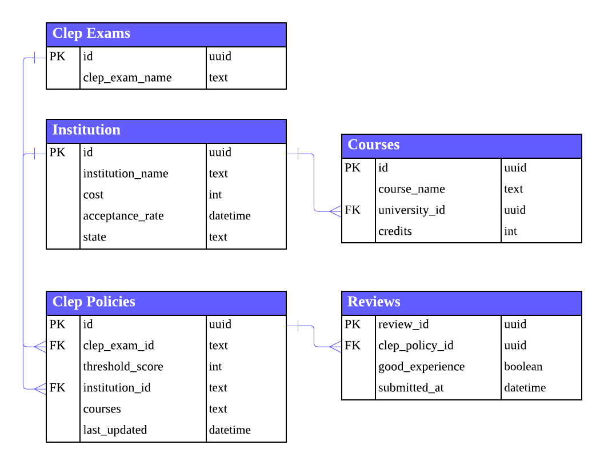

# CLEP Acceptance Dashboard 📝✨

> **🏆 JPMC Code for Good Hackathon 2025** | **📍 Columbus, Ohio**  
> **Built for Modern States Education Alliance**

**[Demo Video](https://buckeyemailosu-my.sharepoint.com/:v:/g/personal/kamath_62_buckeyemail_osu_edu/EZrKw-jAe6xFhopfud6oLbYBHKZyh41nZmX4ryD3OVS_Jw?nav=eyJyZWZlcnJhbEluZm8iOnsicmVmZXJyYWxBcHAiOiJPbmVEcml2ZUZvckJ1c2luZXNzIiwicmVmZXJyYWxBcHBQbGF0Zm9ybSI6IldlYiIsInJlZmVycmFsTW9kZSI6InZpZXciLCJyZWZlcnJhbFZpZXciOiJNeUZpbGVzTGlua0NvcHkifX0&e=5hSkyZ)**

A comprehensive, full-stack web application that empowers students to discover colleges accepting CLEP credits based on their exam scores and location preferences. Developed during the JPMC Code for Good hackathon in Columbus, Ohio to address the critical challenge of CLEP credit policy transparency in higher education.

---

## 👥 Team

Built by **Team 16** at the **JPMC Code for Good Hackathon 2025** in **Columbus, Ohio**

Members: [**Haruto Suzuki**](https://www.linkedin.com/in/haruto-s/) • [**Naveen Kamath**](https://www.linkedin.com/in/naveen-kamath-434668287/) • [**Elizabeth Woo**](https://www.linkedin.com/in/elizabethwoo5/) • [**Baseer Sharief**](https://www.linkedin.com/in/baseershariefcs/) • [**Leonardo Medina**](https://www.linkedin.com/in/leomedina254/) • [**Karan Tandra**](https://www.linkedin.com/in/karan-tandra/) • [**Aakash Kalmady**](https://www.linkedin.com/in/aakashkalmady/)

Mentors: Mr. Ahmir Robinson • Ms. Lydiasheen Rhymond • Mr. Parshva Shah


---

## 🎯 Project Overview

**The Problem**: Students lack clear, accessible information about which colleges accept their CLEP exam scores, making it difficult to maximize their transfer credits and reduce tuition costs. Additionally, institutions struggle to keep their CLEP acceptance policies up-to-date and accessible to prospective students.

**The Solution**: A scalable, data-driven dashboard that aggregates verified CLEP acceptance policies from over 2,900 institutions, enabling:
- **Students** to search colleges by CLEP exam scores and location, visualize institutions on an interactive map, and access real-time, verified CLEP policy data
- **Institutions** to easily update and manage their CLEP acceptance policies, including which exams they accept, minimum required scores, corresponding course credits, and course equivalencies through an intuitive dashboard interface
- **Administrators** to moderate institution requests, approve new entries, and maintain data quality across the platform

**Impact**: Helps students make informed decisions about college transfers, potentially saving thousands of dollars in tuition by maximizing CLEP credit acceptance. Empowers institutions to maintain accurate, up-to-date policy information that directly benefits student decision-making.

---

## ✨ Key Features

### 🔍 Advanced Search & Filtering
- **Location-based filtering**: Search by state (in-state/out-of-state preferences)
- **CLEP score matching**: Intelligent algorithm matches student scores with institution requirements
- **Multi-criteria filtering**: Filter by cost, acceptance rate, and credit limits
- **Real-time search**: Instant results with debounced input handling

### 🗺️ Interactive Mapping
- **Leaflet integration**: Interactive map with college markers
- **Geolocation support**: Uses browser geolocation API for user location
- **Route planning**: Visual routing between selected colleges or from user location
- **State-focused views**: Filter and focus on specific states
- **Custom markers**: Color-coded markers for different locations

### 🎓 Multi-User System
- **Role-based access**: Three distinct user types (Learners, Universities, Admins)
- **University Dashboard**: Institutions can manage their CLEP scoring policies
- **Admin Dashboard**: Centralized management of institution requests and system statistics
- **Authentication flow**: Embedded login with context-aware routing

### 🏛️ University Management
- **Self-Service Policy Updates**: Institutions can independently update their CLEP acceptance policies through a dedicated dashboard
- **CLEP Policy Management**: Add, edit, and delete CLEP exam policies with intuitive forms
- **Flexible Scoring System**: Support for multiple credit tiers per exam (e.g., Physics 65 = 3 credits for lecture only, Physics 70 = 4 credits for lecture + lab)
- **Course Equivalency Mapping**: Institutions can specify which CLEP exams correspond to which courses and credit amounts
- **Threshold Score Configuration**: Set minimum required scores for each CLEP exam to earn credits
- **Institution Requests**: Universities not yet in the system can request to be added
- **Inline Editing**: Real-time updates with optimistic UI for immediate feedback
- **Policy History**: Track when policies were last updated for data freshness validation

### 📊 Data Quality & Reviews
- **Review system**: Students can provide feedback on CLEP policy accuracy
- **Time-based validation**: Policies flagged if not updated within a year
- **Crowdsourced verification**: Aggregate review scores for policy reliability
- **Admin moderation**: Approval workflow for institution requests

### 🎨 Modern UI/UX
- **Dark mode support**: System-wide theme switching with localStorage persistence
- **Responsive design**: Mobile-first approach with breakpoint optimization
- **Material-UI components**: Consistent design system with custom theming
- **Tailwind CSS**: Utility-first styling for rapid development
- **Smooth animations**: Framer Motion for polished interactions

---

## 🛠️ Tech Stack

### Frontend

| Category | Technology | Purpose |
|----------|------------|---------|
| **Language** |  | Type-safe JavaScript for frontend development |
| **Framework** |  | Component-based UI library for building interactive user interfaces |
| **Build Tool** |  | Fast build tool and development server with HMR |
| **Routing** |  | Client-side routing and navigation |
| **UI Library** |  | React component library with Material Design |
| **UI Components** |   | Modular and accessible component libraries |
| **Styling** |  | Utility-first CSS framework for rapid UI development |
| **Maps** | | Interactive maps with routing and directions |
| **Geocoding** |  | Geocoder autocomplete for location input |
| **Animations** |  | Production-ready motion library for React |
| **Code Quality** |  | Code quality and consistency standards |
| **Type Checking** |  | TypeScript-specific linting rules |

### Backend

| Category | Technology | Purpose |
|----------|------------|---------|
| **Language** |  | Backend programming language |
| **Framework** |  | Lightweight Python web framework for REST API |
| **Database** |  | Backend-as-a-Service with PostgreSQL database |
| **CORS** |  | Cross-origin resource sharing support |
| **Configuration** |  | Environment variable management |
---

## 🏗️ Architecture

### Frontend Architecture
```
frontend/
├── src/
│   ├── components/          # Reusable UI components
│   │   ├── collegeCards.tsx        # College display cards
│   │   ├── filterFrame.tsx         # Advanced filtering UI
│   │   ├── Map.tsx                 # Interactive map component
│   │   ├── UniversityDashboard.tsx # University management
│   │   ├── AdminDashboard.tsx      # Admin interface
│   │   └── CLEPScoringManager.tsx  # CLEP policy editor
│   ├── containers/          # Page-level containers
│   │   └── CollegeContainer.tsx    # Main college listing
│   ├── contexts/           # React context providers
│   │   └── ThemeContext.tsx        # Global theme management
│   └── App.tsx             # Main application router
```

**Design Patterns**:
- **Component Composition**: Modular, reusable components
- **Context API**: Global state management for theme
- **Custom Hooks**: Encapsulated logic (e.g., `useThemeMode`)
- **Type Safety**: Full TypeScript implementation

### Backend Architecture
```
backend/
├── routes/                 # API route handlers
│   ├── institutions.py     # Institution CRUD operations
│   ├── clep_policies.py   # CLEP policy management
│   ├── clep_exams.py      # CLEP exam definitions
│   └── reviews.py         # Review system endpoints
├── config/                # Configuration
│   └── supabase.py        # Database client initialization
└── server.py              # Flask application entry point
```

**API Design**:
- **RESTful endpoints**: Standard HTTP methods (GET, POST, PUT, DELETE)
- **Blueprint architecture**: Modular route organization
- **Error handling**: Comprehensive error responses with status codes
- **Data validation**: Type checking and required field validation

#### API Endpoints

**Institutions**
- `GET /api/institutions` - Get all institutions
- `GET /api/institutions_all` - Get institutions with CLEP policies
- `POST /api/institutions` - Create new institution
- `PUT /api/institutions/<uni_id>` - Update institution
- `DELETE /api/institutions/<uni_id>` - Delete institution

**CLEP Policies**
- `GET /api/clep_policies` - Get all CLEP policies
- `POST /api/clep_policies` - Create new CLEP policy
- `PUT /api/clep_policies/<uuid>` - Update CLEP policy
- `DELETE /api/clep_policies/<uuid>` - Delete CLEP policy
- `POST /api/clep_policies/filter` - Filter policies by student criteria

**CLEP Exams**
- `GET /api/clep_exams` - Get all CLEP exams
- `POST /api/clep_exams` - Create new CLEP exam
- `PUT /api/clep_exams` - Update CLEP exam
- `DELETE /api/clep_exams` - Delete CLEP exam

**Reviews**
- `GET /api/reviews` - Get all reviews
- `POST /api/reviews` - Create new review
- `PUT /api/reviews/<review_id>` - Update review
- `DELETE /api/reviews/<review_id>` - Delete review

### Database Schema



---

## 🎯 Technical Highlights

### Advanced Filtering Algorithm
- **Intelligent matching**: Matches student CLEP scores with institution requirements
- **Multi-criteria filtering**: Combines location, cost, acceptance rate, and credit limits
- **Time-based validation**: Flags policies not updated within a year
- **Review aggregation**: Incorporates user reviews for policy reliability

### Real-time Data Management
- **Supabase integration**: Real-time database updates with PostgreSQL
- **Optimistic UI updates**: Immediate feedback with backend synchronization
- **Error handling**: Comprehensive error handling with user-friendly messages
- **Data validation**: Type checking and required field validation on both client and server

### Modern Frontend Patterns
- **TypeScript**: Full type safety throughout the application
- **Context API**: Global state management for theme and user preferences
- **Custom hooks**: Reusable logic encapsulation
- **Component composition**: Modular, maintainable component structure

### Scalable Backend Architecture
- **Blueprint organization**: Modular route handlers for maintainability
- **RESTful API design**: Standard HTTP methods and status codes
- **Database abstraction**: Supabase client for database operations
- **Environment configuration**: Secure environment variable management

---

## 🔮 Future Enhancements

- [ ] **Mobile View Friendly**: Enhanced responsive design and mobile-optimized UI for seamless experience on smartphones and tablets
- [ ] **Google Maps API Integration**: Replace Leaflet with Google Maps API for enhanced map features, street view, and better routing capabilities
- [ ] **AI Agent/Chatbot**: Intelligent chatbot for learners and admins to answer questions about CLEP policies, provide recommendations, and assist with navigation

---

## 🙏 Acknowledgments

- **Modern States Education Alliance** for the opportunity to solve a real-world problem
- **JPMC Code for Good** for organizing the hackathon
- **Supabase** for providing the backend infrastructure
- All open-source contributors whose libraries made this project possible

---

## 🚀 Getting Started

### Prerequisites

- **Node.js** (v18 or higher) and **npm**
- **Python** (v3.8 or higher) and **pip**
- **Supabase account** ([Sign up here](https://supabase.com))

### Environment Setup

1. **Clone the repository**
   ```bash
   git clone <repository-url>
   cd Team-16
   ```

2. **Create `.env` file**
   Create a `.env` file in the root directory with the following variables:
   ```env
   SUPABASE_URL=your_supabase_project_url
   SUPABASE_KEY=your_supabase_anon_key
   ```

   **Getting Supabase credentials**:
   1. Go to [Supabase Dashboard](https://supabase.com/dashboard)
   2. Create a new project or select an existing one
   3. Navigate to **Project Settings → API**
   4. Copy the `URL` and `anon public` key
   5. Paste them into your `.env` file

   > ⚠️ **Security Note**: Never commit your `.env` file to version control. Ensure `.env` is listed in `.gitignore`.

### Backend Setup

1. **Navigate to backend directory**
   ```bash
   cd backend
   ```

2. **Create virtual environment** (recommended)
   ```bash
   python3 -m venv venv
   ```

3. **Activate virtual environment**
   - **macOS/Linux**:
     ```bash
     source venv/bin/activate
     ```
   - **Windows**:
     ```bash
     venv\Scripts\activate
     ```

4. **Install dependencies**
   ```bash
   pip install -r requirements.txt
   ```

5. **Set up database**
   - Log in to your Supabase dashboard
   - Navigate to **SQL Editor**
   - Run the SQL script from `backend/create_table.sql` to create the required tables

6. **Start the Flask server**
   ```bash
   python server.py
   ```
   The backend will run on `http://localhost:5000`

### Frontend Setup

1. **Navigate to frontend directory**
   ```bash
   cd frontend
   ```

2. **Install dependencies**
   ```bash
   npm install
   ```

3. **Start development server**
   ```bash
   npm run dev
   ```
   The frontend will run on `http://localhost:5173` (or the port shown in your terminal)

### Running the Application

1. **Start the backend** (Terminal 1)
   ```bash
   cd backend
   source venv/bin/activate  # On macOS/Linux
   python server.py
   ```

2. **Start the frontend** (Terminal 2)
   ```bash
   cd frontend
   npm run dev
   ```

3. **Open your browser**
   Navigate to `http://localhost:5173`

---

**Made with ❤️ for Modern States Education Alliance**
